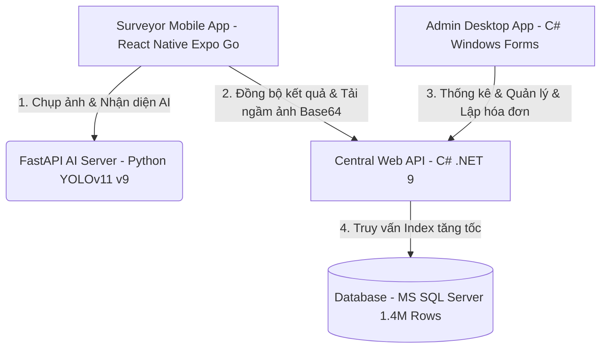

# 💧 Smart Water Meter AI - Hệ Thống Ghi Chỉ Số Nước Thông Minh
> **Hệ sinh thái đa nền tảng tự động hóa quy trình đọc chỉ số đồng hồ nước tích hợp Trí tuệ nhân tạo (AI - YOLOv11) & Tối ưu hóa Dữ liệu lớn (1.4+ Triệu khách hàng)**

---

## 🏗️ Tổng Quan Hệ Sinh Thái (Ecosystem Architecture)

Hệ thống được phát triển chuyên nghiệp với kiến trúc phân tầng (Multi-tier) bao gồm **5 thành phần chính** kết nối đồng bộ:



---

## 🇻🇳 TIẾNG VIỆT (VIETNAMESE)

### 🚀 Tính Năng Nổi Bật

#### 1. 📱 Ứng Dụng Di Động Ghi Nước (DHN_APP)
*   **Ghi số thông minh:** Giao diện cuốn chiếu theo Lộ trình (MLT), Đợt, và Máy ghi nước.
*   **Trợ lý AI:** Chụp ảnh trực tiếp, tự động gửi lên server AI nhận diện chỉ số chỉ trong **0.5 giây**, điền tự động số nước.
*   **Ngoại tuyến & Đồng bộ:** Lưu cache lịch sử tiêu thụ 3 kỳ gần nhất, hỗ trợ lưu trữ tạm thời khi mất kết nối mạng.
*   **Tải ảnh ngầm (Asynchronous Lazy Loading):** Tự động tải ngầm ảnh Base64 khi xem chi tiết, tránh lag màn hình.

#### 2. 🤖 Máy Chủ Trí Tuệ Nhân Tạo (FastAPI YOLOv11 Server)
*   **Model v9 Cực Hạn:** Sử dụng mô hình YOLOv11 được huấn luyện tinh chỉnh (Fine-tuning) đạt độ chính xác **99.5% mAP** trên tập dữ liệu đồng hồ nước.
*   **Bộ lọc thông minh (Heuristics Filtering):**
    *   *Y-Clustering:* Gom nhóm các chữ số lệch nền trên màn hình LCD, ưu tiên lấy hàng số phía trên.
    *   *Size & Spacing check:* Loại bỏ các nhiễu ảnh và nhận diện sai dựa trên kích thước chữ số chuẩn.
    *   *Dot-filter:* Nhận dạng dấu chấm thập phân để tách số nguyên nước tiêu thụ.

#### 3. 💻 Bộ Não Máy Chủ Trung Tâm (DONGHONUOC_API)
*   **Tối ưu hóa Băng thông Cloud:** Loại bỏ trường ảnh Base64 khỏi danh sách chung, giảm dung lượng gói tin tải **99.9% (từ 50MB xuống còn 50KB)**, dập tắt hoàn toàn lỗi **Connection Timeout 30s**.
*   **API Ảnh Tách Rời:** Endpoint riêng biệt `/api/DocChiSo/hinhanh` phục vụ ảnh Base64 theo nhu cầu (On-Demand).
*   **Bẫy lỗi Cloud IIS:** Xử lý ngoại lệ khởi chạy Python giúp máy chủ IIS Cloud trả về `200 OK` trơn tru thay vì ném lỗi `500 Internal Server Error`.

#### 4. 🖥️ Phần Mềm Quản Trị Hành Chính (DHN_WF)
*   Quản trị danh sách nhân viên ghi nước và phân quyền.
*   Theo dõi tiến độ thực địa của nhân viên theo thời gian thực (Real-time tracking).
*   Tính tiền nước lũy tiến tự động và xuất hóa đơn PDF trực quan.

---

### ⚡ Giải Pháp Tối Ưu Hóa Hiệu Năng (Đặc Điểm Nổi Bật)

*   **Chỉ mục phức hợp (Composite Indexing):** Khắc phục triệt để bài toán tìm kiếm trên bảng `DocSo` quy mô **1,424,500 dòng** bằng Index `IX_DocSo_Nam_Ky_Dot_May` trên các cột `(Nam, Ky, Dot, May)`. Chuyển truy vấn quét toàn bảng (Full Table Scan) từ **30+ giây** về **< 1 miligiây**.
*   **Tự động thử lại AI (AI Serverless Auto-Retry):** Nhúng thuật toán thử lại 3 lần với khoảng chờ 2 giây để vượt qua hiện tượng **Khởi động lạnh (Cold-Start 503)** của máy chủ Serverless AI khi ngủ đông.

---

### 🛠️ Cấu Hình & Cài Đặt Khởi Chạy

#### 1. Cơ sở dữ liệu (MS SQL Server)
1. Kết nối với SQL Server bằng SSMS (Local hoặc Cloud).
2. Chạy lệnh sau để tạo chỉ mục tối ưu hóa tốc độ:
   ```sql
   CREATE NONCLUSTERED INDEX IX_DocSo_Nam_Ky_Dot_May 
   ON DocSo (Nam, Ky, Dot, May);
   ```

#### 2. Backend API (C# .NET 9)
1. Di chuyển vào thư mục `DONGHONUOC_API`.
2. Khôi phục các thư viện và chạy:
   ```bash
   dotnet restore
   dotnet run
   ```
3. Server cục bộ sẽ khởi động tại: `http://localhost:5000` (đã hỗ trợ cấu hình Swagger UI).

> [!NOTE]
> File ZIP deploy hoàn chỉnh trên môi trường IIS Cloud đã được đóng gói sẵn tại:
> `DONGHONUOC_API/publish_output.zip`

#### 3. AI Server (FastAPI & YOLOv11)
1. Đảm bảo máy tính đã cài đặt Python 3.10+ và các thư viện trong `requirements.txt`.
2. Khởi chạy server AI tại cổng 8001:
   ```bash
   python ai_server_roboflow.py
   ```
3. Bạn có thể kiểm tra giao diện nhận diện mô hình thủ công qua trình duyệt tại: `http://localhost:8001/test`.

#### 4. Mobile App (React Native Expo)
1. Di chuyển vào thư mục `DHN_APP`.
2. Cài đặt các gói phụ thuộc và chạy Metro Bundler:
   ```bash
   npm install
   npx expo start
   ```
3. Mở ứng dụng **Expo Go** trên điện thoại Android/iOS và quét mã QR hiển thị ở terminal.
4. **Cấu hình IP:** Trong App di động, truy cập màn hình Cài đặt ⚙️ (màn hình đăng nhập) để nhập IP API C# và IP AI Server tương ứng với mạng Wi-Fi cục bộ của bạn.

---

## 🇺🇸 ENGLISH (ENGLISH)

### 🚀 Key Features

#### 1. 📱 Surveyor Mobile App (DHN_APP)
*   **Smart Reading:** Efficient paginated queue ordered by Route (MLT), Period, and Surveyor Device.
*   **AI-Powered:** Capture photos of water meters and let YOLOv11 automatically predict digits in **0.5s**, pre-filling indices instantly.
*   **Offline Support:** Cache reading history for the last 3 periods; fully support offline caching when field connection is lost.
*   **Lazy Image Loading:** Non-blocking background loading for meter photos to guarantee 60fps mobile interaction.

#### 2. 🤖 AI Inference Server (FastAPI YOLOv11)
*   **Top-Tier Model v9:** Fine-tuned YOLOv11 network achieving **99.5% mAP** for multi-class digit and brand recognition.
*   **Heuristics Post-Processing:**
    *   *Y-Clustering:* Automatically group digits by Y-coordinates and isolate the upper display row to remove LCD reflections.
    *   *Structural Filtering:* Verify digits using aspect ratios, spacing, and decimal-dot boundaries to ensure robust outputs.

#### 3. 💻 Central Core Engine (DONGHONUOC_API)
*   **Cloud Bandwidth Optimizations:** Excluded base64 raw images from bulk lists, compressing the network payload size by **99.9% (from 50MB down to ~50KB)** to eliminate **30s HTTP Timeout** issues.
*   **On-Demand Imaging:** Dedicated `/api/DocChiSo/hinhanh` endpoint serving base64 image strings dynamically.
*   **Graceful Cloud Execution:** Caught process startup exceptions to return `200 OK` safely on remote Cloud hosts.

---

### ⚡ Architectural Performance Hacks

*   **Database Composite Indexing:** Resolved slow lookups on the massive **1,424,500-record** `DocSo` table via `IX_DocSo_Nam_Ky_Dot_May` composite index on `(Nam, Ky, Dot, May)`. Cut search queries from **30+ seconds** down to **< 1ms**.
*   **Cold-Start Auto-Retry:** Integrated a 3-attempt backoff query loop with 2-second sleep intervals to seamlessly handle serverless container cold starts.

---

### 🛠️ Configuration & Setup

#### 1. Database (MS SQL Server)
Create the high-performance non-clustered composite index inside your SQL editor:
```sql
CREATE NONCLUSTERED INDEX IX_DocSo_Nam_Ky_Dot_May 
ON DocSo (Nam, Ky, Dot, May);
```

#### 2. Backend C# API (.NET 9)
1. Navigate to the `DONGHONUOC_API` directory.
2. Run:
   ```bash
   dotnet restore
   dotnet run
   ```
3. The local Swagger portal will spin up at `http://localhost:5000`.

#### 3. AI Inference Server (FastAPI)
1. Fire up the FastAPI YOLOv11 engine:
   ```bash
   python ai_server_roboflow.py
   ```
2. Open your web browser and navigate to `http://localhost:8001/test` to interact with the visual AI sandbox interface!

#### 4. React Native Mobile App (Expo)
1. Navigate to the `DHN_APP` directory.
2. Run the development server:
   ```bash
   npm install
   npx expo start
   ```
3. Scan the generated QR code using your physical device's **Expo Go** application.

---

## 👷 Tech Stack Summary

*   **Frontend Mobile**: React Native, Expo SDK 54, SQLite Local Storage, Axios.
*   **Backend API**: C# ASP.NET Core (.NET 9), Entity Framework Core (ORM), Swagger UI.
*   **AI Engine**: Python 3.10, FastAPI, Roboflow Client SDK, YOLOv11 (Model v9), Pillow.
*   **Administrative UI**: C# Windows Forms (.NET Framework / .NET 9).
*   **Database System**: MS SQL Server 2022.
