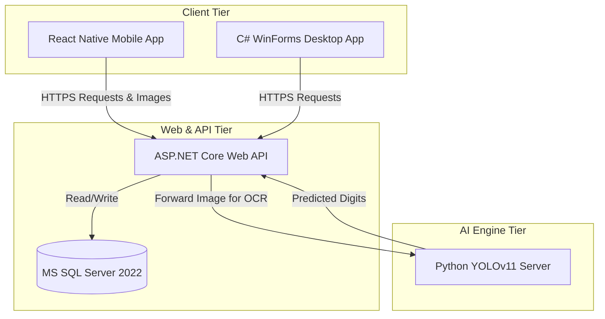

# CHAPTER 1: JOB BACKGROUND

## 1.1. Organization

### 1.1.1. General Information
**Tan Hoa Water Supply Joint Stock Company** is a major public utility enterprise under the Saigon Water Corporation (SAWACO), responsible for managing, maintaining, and expanding the clean water distribution network, as well as managing water commerce across key urban districts of Ho Chi Minh City.

*   **Full Name (Vietnamese):** CÔNG TY CỔ PHẦN CẤP NƯỚC TÂN HÒA
*   **Foreign Name:** TAN HOA WATER SUPPLY JOINT STOCK COMPANY
*   **Abbreviation:** TAN HOA WATER SUPPLY JSC
*   **Headquarters Address:** 215 Tran Thu Do Street, Phu Thanh Ward, Tan Phu District, Ho Chi Minh City
*   **Transaction Office:** 905 Au Co Street, Tan Son Nhi Ward, Tan Phu District, Ho Chi Minh City
*   **Hotline / Phone Number:** 1900.6489
*   **Fax:** 3955 7977

> [!TIP]
> **[PLACEHOLDER: INSERT COMPANY LOGO HERE]**
> *Description: Logo of Tan Hoa Water Supply Joint Stock Company.*

### 1.1.2. History of Establishment and Development
The company has progressed through three primary developmental phases to consolidate its current organizational structure and scale:

*   **Phase 1 (October 2005 – November 2011): Tan Hoa Water Supply Branch**
    Initially established under Decision No. 68/QD-TCT-TC on August 31, 2005, by the Saigon Water Corporation, the branch was formed by separating and reorganizing a portion of the Phu Hoa Tan Water Supply Branch (now Phu Hoa Tan Water Supply JSC) to serve localized water management demands.
*   **Phase 2 (November 2011 – December 2014): Tan Hoa Water Supply One Member Limited Company**
    Pursuant to Decision No. 3745/QD-UBND of the People's Committee of Ho Chi Minh City, the branch was upgraded into a One Member Limited Company to foster greater operational autonomy and modernize its management mechanisms.
*   **Phase 3 (January 2015 – Present): Tan Hoa Water Supply Joint Stock Company**
    Approved under Decision No. 3646/QD-UBND by the municipal People's Committee, the enterprise officially transformed into a Joint Stock Company. Currently, the company is directly authorized by SAWACO to manage the water supply systems, pipeline network infrastructure, and commercial operations serving citizens in the Tan Binh and Tan Phu districts.

### 1.1.3. Corporate Functions, Vision, and Key Activities
The core functions of Tan Hoa Water Supply JSC include:
*   Managing, maintaining, and developing the clean water supply network.
*   Providing and trading clean water for residential consumer consumption and industrial manufacturing.
*   Consulting on water engineering works, civil, and industrial constructions.
*   Designing, constructing, and supervising pipeline installation and road restoration projects.

#### Key Corporate Highlights and Social Campaigns
The enterprise continuously balances business operations with community support and state-aligned development strategies:

*   **Groundwater Reduction & Clean Water Integration (2025):** 
    In 2025, Tan Hoa Water Supply JSC organized a major localized campaign in Tan Son Ward to educate residents on reducing groundwater extraction to avoid land subsidence and contamination. At the event, Ward Leader Mr. Vo Tan Tai highlighted the health benefits of municipal tap water, and 24 model households signed official agreements to transition from private tube wells to the municipal supply network, facilitated by SAWACO application installations.
    
    > [!TIP]
    > **[PLACEHOLDER: INSERT FIGURE 1 HERE]**
    > *Description: Leaders and local residents of Tan Son Ward attending the water preservation and municipal supply campaign.*
    
    > [!TIP]
    > **[PLACEHOLDER: INSERT FIGURE 2 HERE]**
    > *Description: Mr. Le Trung Thanh – Party Committee Member and Deputy Sales Director of the Company, delivering the opening address.*
    
    > [!TIP]
    > **[PLACEHOLDER: INSERT FIGURE 3 HERE]**
    > *Description: Residents signing official commitments to transition from groundwater to municipal clean water, witnessed by SAWACO and local authorities.*
    
    > [!TIP]
    > **[PLACEHOLDER: INSERT FIGURE 4 HERE]**
    > *Description: Members of the Executive Committee and Party Board of Tan Hoa Water Supply JSC witnessing the signing ceremony.*
    
    > [!TIP]
    > **[PLACEHOLDER: INSERT FIGURE 5 HERE]**
    > *Description: Awarding dynamic encouraging gifts and supports to 24 model households transitioning to clean municipal tap water.*

*   **Typical Advanced Representative Conference (2020-2025):**
    On April 16, 2025, the company held its typical advanced conference to honor 12 outstanding collectives and 61 exceptional individuals. Over 5 years, the company achieved aggressive digital transformation breakthroughs (e.g., smart water meters, automated billing, QR payment infrastructure) and received commendations from the Municipal People's Committee.
    
    > [!TIP]
    > **[PLACEHOLDER: INSERT FIGURE 6 HERE]**
    > *Description: Overview and attendance of the Typical Advanced Representative Conference (2020-2025).*

*   **Establishment of "Ho Chi Minh Cultural Space" (August 2025):**
    Celebrating its 20th anniversary, the company inaugurated the "Ho Chi Minh Cultural Space" at its transaction office at 905 Au Co, Tan Son Nhi Ward, fostering an elite service culture and celebrating technological breakthroughs of various teams.
    
    > [!TIP]
    > **[PLACEHOLDER: INSERT FIGURE 7 HERE]**
    > *Description: The newly inaugurated Ho Chi Minh Cultural Space at the 905 Au Co Customer Transaction Center.*

### 1.1.4. Organizational Structure and Departmental Functions
The operational apparatus of Tan Hoa Water Supply JSC is highly structured, ensuring seamless execution across commercial, technical, and administrative divisions:

> [!TIP]
> **[PLACEHOLDER: INSERT FIGURE 8 HERE]**
> *Description: Detailed Organizational Structure and Administrative Hierarchy Chart of Tan Hoa Water Supply Joint Stock Company.*

| Executive Division | Department | Core Functions & Responsibilities |
| :--- | :--- | :--- |
| **Commercial Operations**  *(Led by Deputy Director of Sales)* | **Sales & Customer Relations Dept.** *(Phòng Thương vụ)* | Manages customer water contracts, bill adjustments, resolves customer complaints, and drafts commercial policies. |
| | **Tan Binh Billing Dept.** *(Phòng Ghi thu Tân Bình)* | Operates meter reading activities, invoice issuance, and revenue collection across Tan Binh District. |
| | **Tan Phu Billing Dept.** *(Phòng Ghi thu Tân Phú)* | Operates meter reading activities, invoice issuance, and revenue collection across Tan Phu District. |
| | **Customer Service Dept.** *(Phòng Khách hàng)* | Focuses on direct customer support, inquiries, and processing applications for new water meter installations or technical moves. |
| **Corporate Administration**  *(Led by Managing Director)* | **Human Resources & Admin Dept.** *(Phòng Tổ chức Hành chính)* | Manages labor policies, recruitment, office administration, archiving, and internal logistics. |
| | **Investment & Planning Dept.** *(Phòng Kế hoạch Đầu tư)* | Forecasts business operations, manages procurement processes, and designs infrastructure expansion budgets. |
| | **Finance & Accounting Dept.** *(Phòng Kế toán Tài chính)* | Executes accounting, tax compliance, budget allocation, and controls corporate cash flows. |
| **Technical Operations**  *(Led by Deputy Director of Engineering)* | **Technology & Engineering Dept.** *(Phòng Kỹ thuật Công nghệ)* | Manages clean water distribution infrastructure, GIS utility mappings, IT systems, and ensures network engineering standards. |
| | **Non-Revenue Water Control Dept.** *(Phòng Giảm nước không doanh thu)* | Focuses strictly on leak detection, acoustic monitoring, minimizing pipe bursts, and reducing water loss rates across the network. |
| | **Maintenance & Construction Team** *(Đội Thi công – Tu bổ)* | Executes emergency pipe repairs, network rehabilitation, road restorations, and physical pipe connection tasks. |

### 1.1.5. Advantages and Challenges of the Internship Department
The student was placed in the **Technology & Engineering Department** *(Phòng Kỹ thuật Công nghệ)*. An analysis of the department's operations highlights the following:

#### Key Advantages (Strengths)
*   **Robust IT Infrastructure:** The department is highly advanced in digital transformation, utilizing modern GIS mapping tools, real-time monitoring software, and SAWACO data synchronization pipes.
*   **Supportive Development Environment:** Highly skilled engineers and direct supervisors who provide practical domain knowledge, database schema insights, and high-quality real-world datasets for neural network model training.
*   **Clear Modernization Objectives:** The company actively encourages young talents to build AI-driven solutions (such as automated water meter reading apps) to replace manual errors, reducing data mismatch costs.

#### Key Challenges (Weaknesses)
*   **Manual Verification Bottlenecks:** Despite digital billing systems, physical surveyors still record meter indices manually or take pictures that require human validation, creating delays and error-prone billing cycles.
*   **Complex Real-world Environments:** Water meters are frequently located underground, inside narrow concrete cavities, covered by mud, condensation, or scratch-damaged glass covers. This significantly impacts visual image recognition quality.
*   **Data Integration Complexities:** Transitioning from separate local devices to unified real-time syncing databases requires highly resilient API structures and robust exception handling.

---

## 1.2. Project Management

To successfully deliver the **AI-Integrated Water Meter Reading (DHN) System** during the internship, a structured project management methodology was strictly followed.

### 1.2.1. Methodology: Iterative Agile Framework
An **Iterative Agile Development Methodology** was utilized. Given the multi-tier nature of the project (comprising a C# WinForms client, a .NET Core API server, a React Native mobile application, and a YOLOv11 Python AI server), the work was divided into focused development cycles:
1.  **Requirement Specification & Planning:** Analyzing the provided database schema (`DocSo`, `Lich_DocSo`, `NguoiDungB`), adhering strictly to the enterprise-provided business workflows, and defining RESTful API contracts.
2.  **AI Model Training (YOLOv11):** Annotating and training water meter display datasets to recognize digit sequences.
3.  **API and Database Implementation:** Building a stable ASP.NET Core backend to manage users, logs, and process uploaded images.
4.  **Client Development:** Synchronous development of the React Native client (for surveyors) and C# WinForms client (for office managers).
5.  **Integration & Testing:** Connecting the clients to the API, passing images to the YOLOv11 AI server, parsing predictions, and refining accuracy.

### 1.2.2. Human Resources / Roles & Supervision
The project was executed by a dedicated team of 02 members with clear, professional role divisions under the guidance of academic and enterprise supervisors:

**1. Project Team Members:**
*   **Nguyễn Minh Đăng**
    *   **Role:** Full-stack Developer (Backend & Frontend).
    *   **Tasks:** Developed the ASP.NET Core central API utilizing the enterprise-provided MS SQL Server database schema, programmed the React Native and WinForms user interfaces based on the requested 3-step business flow, and integrated the execution flow of index recognition from the AI server.
*   **Huỳnh Thiên Tân**
    *   **Role:** AI Engineer.
    *   **Tasks:** Responsible for data collection, manual image annotation, configuring network architecture, training, and optimizing the YOLOv11 AI model specialized in reading and extracting index digits from Water Meter LCD dials.

**2. Supervisory Board:**
*   **Academic Supervisor:** **ThS. Trần Thanh Nhã** (Nguyen Tat Thanh University - VIEN-NIIE). Provided structural methodologies, academic validation, and continuous technical feedback throughout the graduation internship period.
*   **Enterprise Supervisor:** **Ông Nguyễn Ngọc Quốc Bảo**
    *   **Title:** Head of Information Technology Department – Tan Hoa Water Supply Joint Stock Company.
    *   **Role in Project:** Oriented professional business operations, provided the core database schema (`DocSo`, `Lich_DocSo`, `NguoiDung`), supplied the calculation logic for domestic water pricing (`GB11`), defined the strict 3-step business workflow requirement, and directly supervised and accepted the project's development progress.

### 1.2.3. Task Assignment and Staging (Internship Evidence)
To align with academic requirements, formal documentation and supervisor communications are incorporated as evidence of the internship task assignment.

#### The Three-Step Meter Reading Workflow Definition
The corporate supervisor at Tan Hoa Water Supply JSC initially presented the core operational flow of the clean water billing cycle, which consists of three key steps:
1.  **Administrative Creation:** Preparing and generating the specific "Reading Schedules" and customer route lists on the central office PC system.
2.  **Field Surveying and Notification:** Field surveyors downloading the assigned database to their mobile devices, physically traveling to houses, checking meters, recording indices, and immediately printing invoice notifications on portable thermal devices.
3.  **Data Finalization:** Uploading field surveyor records back to the desktop system for final approval, locking database logs, and forwarding data to print formal legal invoices.

#### The Core Problem Statement & Staged Objectives
The specific, high-priority challenge assigned to the interns by the enterprise supervisor was: **Automate Step 2 by allowing surveyors to take a physical photograph of the water meter (đhn) and automatically extract the precise reading without any manual keyboard input.** This scope was reviewed and approved by the academic department to ensure it matches the high-quality technical rigor expected of IT candidates.

> [!TIP]
> **[PLACEHOLDER: INSERT EVIDENCE FIGURE A HERE]**
> *Description: Official message communications and task assignment instructions from the enterprise supervisor outlining the three-stage meter reading cycle and the core AI meter index recognition problem statement.*

> [!TIP]
> **[PLACEHOLDER: INSERT EVIDENCE FIGURE B HERE]**
> *Description: Scan of the signed Internship Agreement / Training Contract with Tan Hoa Water Supply Joint Stock Company, outlining official corporate tasks, rights, and supervision codes.*

---

## 1.3. Development Environment

The development environment was tailored to handle hybrid workflows spanning cross-platform mobile development, enterprise desktop development, high-performance web API engineering, and machine learning model training.

### 1.3.1. Hardware Specifications
*   **Workstation:** CPU Intel Core i7 (8 Cores, 16 Threads), 16GB DDR4 RAM, 512GB NVMe SSD.
*   **GPU Resources:** NVIDIA GeForce RTX 3060 (12GB VRAM), leveraged for local dataset training, hyperparameter tuning, and accelerated inference runs of the YOLOv11 model.
*   **Testing Hardware:** Physical Android and iOS mobile devices for field testing the React Native application's camera functionality and API synchronization.

### 1.3.2. Software Stack and Tools

*   **Integrated Development Environments (IDEs):**
    *   **Microsoft Visual Studio 2022:** Used for designing and compiling the C# Windows Forms management application (`DHN_WF`) and the robust ASP.NET Core Web API backend (`DONGHONUOC_API`).
    *   **Visual Studio Code (VS Code):** Used for React Native mobile app development (`DHN_APP`) using TypeScript, as well as Python script adjustments.
*   **Database Management System:**
    *   **Microsoft SQL Server 2022 & SSMS (SQL Server Management Studio):** Utilized for hosting the relational database, structuring customer data, billing schedules, and storing read history.
*   **AI & Machine Learning Frameworks:**
    *   **Python 3.10+ (Anaconda Environment):** Core programming language for AI scripting.
    *   **PyTorch (CUDA Enabled):** Primary backend for running deep learning tasks.
    *   **Ultralytics YOLOv11:** State-of-the-art object detection framework configured for single-digit segmentation and recognition on water meter dials.
    *   **Roboflow:** Used for dataset annotation, label correction, and bounding box validation.
*   **Version Control & API Documentation:**
    *   **Git & GitHub:** For source code versioning and collaborative staging.
    *   **Swagger / OpenAPI UI:** Integrated within the .NET Core backend for seamless API testing and endpoint visualization.
