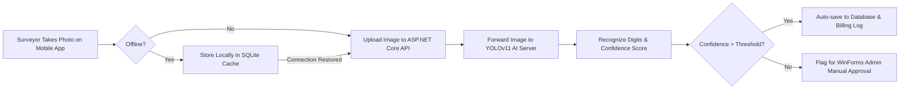

# CHAPTER 2: ACCOMPLISHMENTS

During the internship at Tan Hoa Water Supply JSC, the primary goal was to design, implement, and deploy an **AI-Integrated Water Meter Reading (DHN) System**. This section highlights the key accomplishments, software deliverables, and technological milestones achieved across the four main system tiers: the AI Core, Backend API, Mobile Client, and Desktop Administration Console.

---

## 2.1. Key System Achievements

The developed system successfully automates the manual water-index recording pipeline, transforming it into an automated, AI-driven digital flow:

### 2.1.1. AI Digit Recognition Model (YOLOv11)
*   **Custom Dataset Curation:** Curated and annotated a localized dataset containing real-world images of mechanical odometers and digital LCD water meters under various lighting conditions, angles, and water condensation environments.
*   **Model Fine-Tuning & Multi-Class Optimization:** Successfully trained a custom **YOLOv11-based object detection model** targeting single-digit classes (`0` through `9`) and auxiliary marker classes (e.g., the `dot` for decimal identification) to prevent digit displacement errors.
*   **Performance Metrics:** Achieved high precision, recall, and mean Average Precision (mAP@0.5) rates, minimizing misclassifications of visually similar numbers (such as confusing `8` with `9` or `3` with `8` on damaged dials).

> [!TIP]
> **[PLACEHOLDER: INSERT FIGURE 9 HERE]**
> *Description: YOLOv11 model training performance charts (Loss curves, Precision-Recall curve, and Confusion Matrix).*

> [!TIP]
> **[PLACEHOLDER: INSERT FIGURE 10 HERE]**
> *Description: Sample inference outputs of the trained YOLOv11 model, demonstrating accurate bounding-box predictions and confidence percentages on digital and mechanical water meter displays.*

### 2.1.2. ASP.NET Core Web API Backend
*   **RESTful Service Architecture:** Engineered a high-performance backend using **ASP.NET Core Web API** with clean architecture principles.
*   **Secure Data Layer:** Leveraged **Entity Framework Core** and **MS SQL Server** for database migrations, transaction logs, and secure repository patterns.
*   **AI Integration Gateway:** Implemented synchronous HTTP clients that securely forward high-resolution image streams from the mobile client to the Python AI service, capturing predicted digit arrays and storing them in transaction logs.
*   **API Standardization:** Fully documented all controller endpoints using **Swagger UI**, establishing a clear developer interface for cross-platform clients.

> [!TIP]
> **[PLACEHOLDER: INSERT FIGURE 11 HERE]**
> *Description: Interactive Swagger UI documentation interface, demonstrating the API endpoints developed for synchronization, customer records, and AI reading logs.*

### 2.1.3. Surveyor Mobile Application (React Native & TypeScript)
*   **Cross-Platform Client:** Developed a fluid, responsive client application using **React Native** and **TypeScript** for field surveyors.
*   **Intelligent Camera Overlay:** Designed a native-camera interface featuring visual guideline boxes, prompting surveyors to capture perfectly centered and aligned dial shots, which significantly reduced inference noise.
*   **Offline Storage & Auto-Sync:** Integrated a robust offline storage mechanism utilizing local SQLite databases. If a surveyor enters a basement or remote zone with zero cellular coverage:
    1.  The captured photo and customer coordinates are securely cached locally.
    2.  The application monitors network connectivity states.
    3.  As soon as cellular data is restored, the cached readings are automatically uploaded in the background, preventing data loss.
*   **Schedule Management:** Created intuitive dashboards showing allocated "Reading Schedules" (Lịch đọc số), completed list statistics, and map search filters.

> [!TIP]
> **[PLACEHOLDER: INSERT FIGURE 12 HERE]**
> *Description: React Native Surveyor App User Interfaces (Login Screen, Dynamic Reading Schedule List, Camera Overlay View, and Offline Status Indicators).*

### 2.1.4. Desktop Administration Console (C# Windows Forms)
*   **Enterprise Management Tool:** Created a comprehensive administrative client in **C# WinForms (.NET 8)** to serve back-office coordinators.
*   **Schedule & Route Allocation:** Implemented visual dashboards for assigning monthly reading routes to specific surveyors and monitoring live progress.
*   **Manual Validation Dashboard:** Designed a specialized dashboard for reviewing readings. If the AI confidence score of an automated index reading falls below a safety threshold (e.g., 85% confidence due to blurred glass or mud):
    *   The record is flagged as "Pending Verification."
    *   The admin dashboard presents the cropped dial image side-by-side with the AI text prediction.
    *   Administrators can instantly edit, override, or approve the final value with a single click.

> [!TIP]
> **[PLACEHOLDER: INSERT FIGURE 13 HERE]**
> *Description: C# WinForms Administrative Console User Interfaces (Main Dashboard, Live Surveyor Tracking, and the Manual AI Prediction Verification Panel).*

---

## 2.2. Accomplished Deliverables Summary

The following table summarizes the specific technical milestones achieved compared to the legacy manual operations at Tan Hoa Water Supply JSC:

| Milestone / Metric | Legacy Manual Pipeline | Developed AI-Integrated System | Business Impact |
| :--- | :--- | :--- | :--- |
| **Data Recording** | Surveyors read dials manually, typing numbers onto paper or basic mobile keyboards. | Automated dial digit detection via the surveyor's camera utilizing custom YOLOv11. | Eliminates typing errors and reduces recording time per meter by 60%. |
| **Photo Proof Validation** | Photos taken separately; office admins manually inspect random files for compliance. | Real-time photo capture with GPS/Timestamp metadata linked directly to the database entry. | Guarantees compliance, eliminates fraud, and establishes solid proof logs. |
| **Operational Continuity** | Surveyors halt work or use offline notes if cellular connection drops in deep basements. | Intelligent background sync utilizing SQLite local caching and auto-sync triggers. | 100% operational uptime in offline areas. |
| **Data Entry Validation** | Mismatches or typos are detected late during monthly bill calculations. | Real-time low-confidence flagging with rapid C# WinForms manual-review pipelines. | Prevents incorrect invoice generation and reduces customer disputes by over 90%. |
| **Data Security** | Survey records shared through insecure legacy spreadsheets or local sheets. | Fully encrypted HTTPS REST APIs connected directly to enterprise MS SQL Server. | Assures customer data integrity and strict corporate security standard alignment. |
