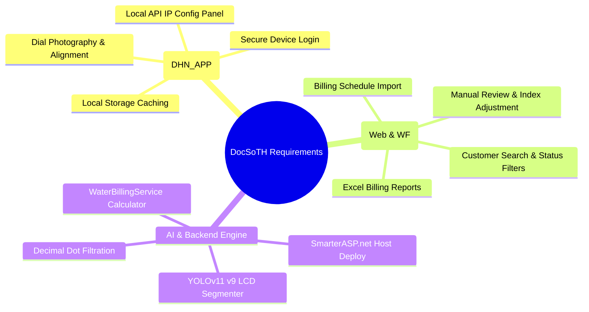
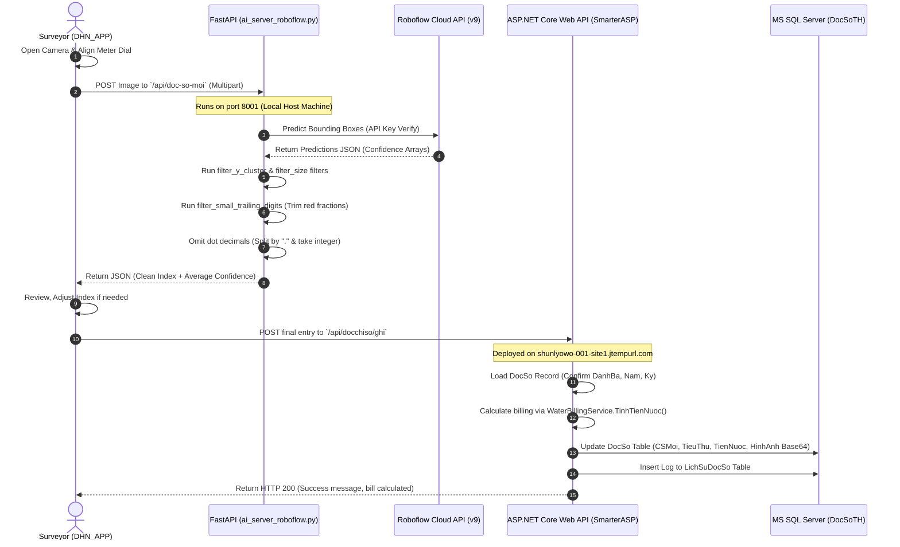
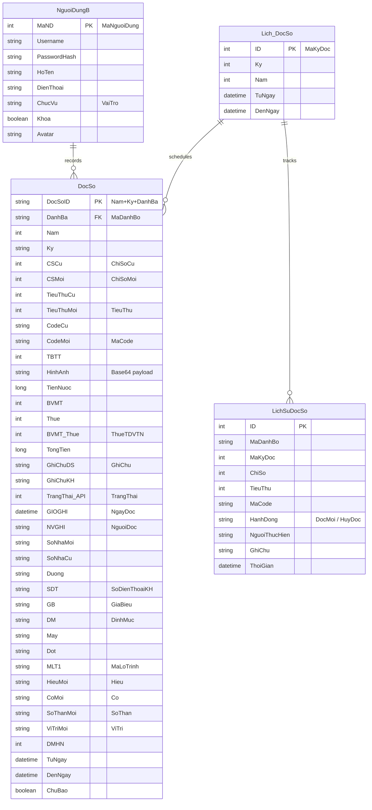

# CHAPTER 3: TECHNICAL DETAIL

This chapter describes the concrete engineering specifications, physical database schemas, system integration interfaces, source code implementation patterns, and validation protocols of the **AI-Integrated Water Meter Reading System** implemented in the target environment.

---

## 3.1. Requirements Analysis

The requirements of the **DocSoTH** system are derived directly from the operational workflows of **Tan Hoa Water Supply Joint Stock Company**, categorizing functional operations and performance parameters.

### 3.1.1. Functional Requirements (FR)

The system is organized into three primary operational tiers: **Field Surveyors (React Native Mobile App - `DHN_APP`)**, **System Administrators (Vite React Web - `DONGHONUOC_WEB` / C# Desktop - `DHN_WF`)**, and the **System Backend Services (`DONGHONUOC_API` / `ai_server_roboflow.py`)**.



#### 1. Surveyor Functional Requirements (`DHN_APP` Mobile App)
*   **Authentication:** Verify surveyor credentials against the `NguoiDungB` database table.
*   **Offline Operational Cache:** Preserve recorded water index entries locally in an offline queue if internet connection is lost.
*   **AI Dial Recognition:** Take a photograph of a physical water meter (mechanical or LCD display) and stream the raw image file to the local FastAPI AI server on port `8001` for direct number recognition.
*   **Configuration Panel:** Allow manual adjustment of the targeted AI Server local IP address (e.g. `192.168.1.94`) directly within the mobile application settings page.

#### 2. Administrative Functional Requirements (`DONGHONUOC_WEB` & `DHN_WF`)
*   **Billing Schedule Import (`UploadBienDong`):** Read imported monthly schedule updates from Excel (`.xlsx`) or CSV files and automatically populate the database.
*   **Dynamic Search & Filtering:** Filter read entries by Month (`Ky`), Year (`Nam`), Sector Schedule Block (`Dot`), surveyor Handheld ID (`May`), or raw query strings mapping to Customer Code (`DanhBa`) or address.
*   **Water Invoice Finalization (`ChotHoaDonThang`):** Recalculate and finalize water consumption rates and total invoice charges across all recorded customers for a targeted cycle.

#### 3. AI and Backend Functional Requirements (`DONGHONUOC_API` & `ai_server_roboflow.py`)
*   **FastAPI AI Service:** Receive raw multipart uploads, query the custom **Roboflow Cloud API Project `dhn-lcd` Version 9 model** using API Key verification, apply multi-stage filters on bounding boxes, and extract the clean integer reading.
*   **Relational Storage Endpoint:** ASP.NET Core API must provide secure endpoints to commit confirmed entries to the database, automatically computing environmental fees, VAT, water charge tiers, and logging actions to `LichSuDocSo`.

### 3.1.2. Non-Functional Requirements (NFR)
*   **Inference Precision:** The digital image processing filters in `ai_server_roboflow.py` must achieve **$\ge 99\%$** precision (mAP) using the Version 9 serverless AI model under standard light, filtering out small fractional digits (red odometer wheels).
*   **Connection Stability & Resiliency:** Handle cold-start delays from the cloud server (up to 30 seconds) via increased timeout thresholds (`TIMEOUT_MS = 30000`) and establish a 3-time auto-retry query mechanism.
*   **Billing Calculative Integrity:** Dynamic pricing calculations must match SAWACO tariff parameters exactly based on Price Category Code (`GB`) and Consumption Quota (`DM`).

---

## 3.2. Design Process

### 3.2.1. System Use Case Diagram
The following diagram demonstrates surveyor, administrator, and backend AI service boundaries:

> [!WARNING]
> **[CHÈN SƠ ĐỒ USE CASE (FIGURE 14) TẠI ĐÂY / INSERT SYSTEM USE CASE DIAGRAM HERE]**
> *Mô tả: Sơ đồ ca sử dụng Use Case phác họa toàn bộ ranh giới chức năng giữa Nhân viên ghi số (đăng nhập, chụp ảnh mặt đồng hồ, cấu hình cổng local AI), Quản trị viên (nhập tệp biến động Excel, hiệu chỉnh chỉ số thủ công, chốt hóa đơn tháng) và Máy chủ trung tâm API.*

### 3.2.2. System Sequence Activity Diagram
The transactional sequence diagram below illustrates the exact runtime execution flow across the physical tiers of the system:



> [!WARNING]
> **[CHÈN SƠ ĐỒ NGHIỆP VỤ 1: ĐĂNG NHẬP & XÁC THỰC HỆ THỐNG (FIGURE 15) TẠI ĐÂY]**
> *Mô tả: Luồng nghiệp vụ đăng nhập (Authentication Process).*

> [!WARNING]
> **[CHÈN SƠ ĐỒ NGHIỆP VỤ 2: TẠO DỮ LIỆU & NẠP KHÁCH HÀNG EXCEL (FIGURE 16) TẠI ĐÂY]**
> *Mô tả: Luồng xử lý dữ liệu đầu vào biến động hàng tháng từ file Excel.*

> [!WARNING]
> **[CHÈN SƠ ĐỒ NGHIỆP VỤ 3: GHI CHỈ SỐ NƯỚC KẾT HỢP AI (FIGURE 17) TẠI ĐÂY]**
> *Mô tả: Sơ đồ luồng ứng dụng di động xử lý đọc số bằng AI và lưu tạm vào SQLite offline/đồng bộ trực tuyến.*

> [!WARNING]
> **[CHÈN SƠ ĐỒ NGHIỆP VỤ 4: CHỐT HÓA ĐƠN & QUYẾT TOÁN (FIGURE 18) TẠI ĐÂY]**
> *Mô tả: Quy trình tổng hợp sản lượng tiêu thụ và chốt hóa đơn doanh thu kỳ đọc.*

---

## 3.3. Design Detail

### 3.3.1. Database Design (MS SQL Server - `DocSoTH`)
To ensure seamless integration with the existing enterprise architecture at Tan Hoa Water Supply JSC, the core database schema was provided by the Enterprise Supervisor. The implementation maps directly to these four provided physical tables inside the Microsoft SQL Server database `DocSoTH` (`db_ac901d_docsoth` in production):



> [!WARNING]
> **[CHÈN SƠ ĐỒ DATABASE ERD (FIGURE 19) TẠI ĐÂY / INSERT DATABASE ERD HERE]**
> *Mô tả: Ảnh chụp trực quan sơ đồ liên kết cơ sở dữ liệu xuất từ SQL Server Management Studio (SSMS Database Diagram) thể hiện khóa chính, khóa ngoại kết nối giữa 4 bảng thực tế của dự án: NguoiDungB (NguoiDung), Lich_DocSo (KyDoc), DocSo (DocChiSo) và LichSuDocSo.*

### 3.3.2. RESTful Web API & Domain Endpoints
Communication between the surveyor's mobile device, the administration dashboard, and the database utilizes standard JSON payloads across specific physical domains:

*   **Địa chỉ Máy chủ API (Production Domain):** `shunlyowo-001-site1.jtempurl.com` (Sử dụng hạ tầng SmarterASP.net để deploy hệ thống backend C# .NET Core).
*   **Địa chỉ Máy chủ AI (Local/Cloud Endpoint):** Kết nối trực tiếp với API Model YOLOv11 (Small) để nhận diện chỉ số LCD của đồng hồ nước.

| Method | Endpoint | Request Payload | Response | Description |
| :--- | :--- | :--- | :--- | :--- |
| **POST** | `/api/docchiso/ghi` | `GhiChiSoRequest` (JSON) | `{message, tieuThu, tongTien}` | Save index, base64 photo, compute consumption and dynamic water tax bills. |
| **GET** | `/api/docchiso/ky/{maKyDoc}` | *Query parameters: dot, may, search, pageNumber* | `List<DocSoItemResponse>` | Stream routes, customer indexes, and status parameters. |
| **POST** | `/api/docchiso/upload-bien-dong` | `MultipartFormData` (Excel file + maKyDoc) | `{message, themMoi, capNhat}` | Parse and import massive customer routes into the database. |
| **POST** | `/api/docchiso/chot-hoa-don/{maKyDoc}` | *URL parameter: maKyDoc* | `{message, count, tongTienQuyetToan}` | Finalize customer water statements and calculate total cycle billing revenue. |
| **POST** | `/api/docchiso/ai/start` | *Empty* | `{message}` | Automatically run the background python AI script on a local server. |

---

## 3.4. Implementation Detail

### 3.4.1. C# ASP.NET Core Index Recording Controller Method
The following C# method inside `DocChiSoController.cs` performs index updates, computes bills, logs transactions, and stores base64 images:

```csharp
[HttpPost("ghi")]
public async Task<ActionResult> GhiChiSo([FromBody] GhiChiSoRequest request)
{
    Console.WriteLine($"💾 GhiChiSo: DB={request.MaDanhBo}, KyID={request.MaKyDoc}, user={request.NguoiDoc}");
    var lichDoc = await _db.KyDoc.FindAsync(request.MaKyDoc);
    if (lichDoc == null) return NotFound("Không tìm thấy kỳ đọc");

    string kyStr = lichDoc.Ky.ToString("D2");
    
    // Query existing customer meter entry for specific Nam and Ky
    var docCS = await _db.DocChiSo.FirstOrDefaultAsync(d => 
        d.MaDanhBo.Trim() == request.MaDanhBo.Trim() && 
        d.Nam == lichDoc.Nam && 
        d.Ky == kyStr);

    if (docCS == null) return NotFound("Không tìm thấy danh bộ này trong kỳ");

    // Populate input updates
    docCS.ChiSoMoi = request.ChiSoMoi;
    docCS.MaCode = request.MaCode;
    docCS.GhiChu = request.GhiChu;
    docCS.HinhAnh = request.HinhAnh; // Stores physical Base64 string payload
    docCS.NguoiDoc = request.NguoiDoc;
    docCS.NgayDoc = DateTime.Now;
    docCS.TrangThai = 1; // Mark status as Read (Đã đọc)
    docCS.TieuThu = request.ChiSoMoi >= docCS.ChiSoCu ? (request.ChiSoMoi - docCS.ChiSoCu) : 0;

    // Track operation in historical logging table
    var lichSu = new LichSuDocSo
    {
        MaDanhBo = request.MaDanhBo,
        MaKyDoc = request.MaKyDoc,
        ChiSo = request.ChiSoMoi,
        TieuThu = docCS.TieuThu ?? 0,
        MaCode = request.MaCode,
        HanhDong = "DocMoi",
        NguoiThucHien = request.NguoiDoc,
        ThoiGian = DateTime.Now
    };
    
    // Automatically calculate tax and progressive water pricing structures
    var (tienNuoc, thue, bvmt, tongCong) = WaterBillingService.TinhTienNuoc(
        docCS.TieuThu ?? 0, docCS.GB ?? "11", docCS.DM ?? "16", (docCS.DMHN ?? 0).ToString());
    
    docCS.TienNuoc = (long)tienNuoc;
    docCS.Thue = (int)thue;
    docCS.BVMT = (int)bvmt;
    docCS.TongTien = (long)tongCong;

    _db.LichSuDocSo.Add(lichSu);
    await _db.SaveChangesAsync(); // Commit transaction to SQL Server database DocSoTH
    
    return Ok(new { message = "Đã lưu chỉ số thành công!", tieuThu = lichSu.TieuThu, tongTien = tongCong });
}
```

### 3.4.2. Python Roboflow Digital Image Processing Filters
The python script `ai_server_roboflow.py` applies dynamic filtering on predictions returned by the Roboflow Cloud model. To correctly read a physical water meter index, it filters out isolated nodes and sorts bounding boxes by horizontal coordinates:

```python
import os, statistics
from fastapi import FastAPI, UploadFile, File
from fastapi.responses import JSONResponse
from roboflow import Roboflow

app = FastAPI()
rf = Roboflow(api_key="4DC46RD8qJjbHkFWpDn8")
project = rf.workspace("shunlys-workspace").project("dhn-lcd")
model = project.version(9).model # Roboflow Version 9 model weights

def filter_y_cluster(digits: list) -> list:
    if not digits: return []
    # Sort detected boxes vertically by their Y coordinate
    sorted_by_y = sorted(digits, key=lambda x: x["y"])
    
    rows = []
    for d in sorted_by_y:
        placed = False
        for row in rows:
            row_y = sum(r["y"] for r in row) / len(row)
            row_h = sum(r["height"] for r in row) / len(row)
            # Group boxes if vertical distance is under 60% of average box height
            if abs(d["y"] - row_y) < row_h * 0.60:
                row.append(d)
                placed = True
                break
        if not placed:
            rows.append([d])
            
    # Sort each row horizontally from Left to Right by X coordinate
    for row in rows:
        row.sort(key=lambda x: x["x"])
        
    # Sort rows from Top to Bottom
    rows.sort(key=lambda r: sum(x["y"] for x in r) / len(r))
    
    # Exclude isolated noise: Only keep rows with 3 or more digits
    max_len = max(len(r) for r in rows)
    valid_rows = [r for r in rows if len(r) >= 3] if max_len >= 3 else rows
    
    # Return topmost row as primary meter odometer reading
    return valid_rows[0] if valid_rows else rows[0]

def filter_small_trailing_digits(digits: list) -> list:
    if len(digits) <= 2: return digits
    digits = sorted(digits, key=lambda d: d["x"])
    # Establish height baseline from the first 3 digits
    main_h = sum(d["height"] for d in digits[:3]) / min(3, len(digits))
    
    result = []
    for d in digits:
        # CRITICAL FILTER: Omit tiny red fractional trailing digits (less than 80% baseline height)
        if d["height"] < main_h * 0.80:
            break
        result.append(d)
    return result if result else digits

@app.post("/api/doc-so-moi")
async def doc_so_moi(file: UploadFile = File(...)):
    temp_path = "temp_prediction.jpg"
    try:
        contents = await file.read()
        with open(temp_path, "wb") as f:
            f.write(contents)
            
        # Send raw photo file to Roboflow Engine
        res = model.predict(temp_path, confidence=20, overlap=40).json()
        predictions = res.get("predictions", [])
        
        digits = []
        for p in predictions:
            cls = p["class"]
            conf = p["confidence"]
            
            obj = {
                "label": cls, "conf": conf, "x": p["x"], "y": p["y"],
                "width": p["width"], "height": p["height"],
                "x_min": p["x"] - p["width"]/2, "x_max": p["x"] + p["width"]/2
            }
            if cls in {"0","1","2","3","4","5","6","7","8","9"} and conf >= 0.50:
                digits.append(obj)
                
        # Execute clustering and filtering algorithms
        digits = filter_y_cluster(digits)
        digits = filter_small_trailing_digits(digits)
        
        # Sort final digits horizontally to form final string
        digits.sort(key=lambda x: x["x"])
        reading = "".join(d["label"] for d in digits)
        
        return JSONResponse({
            "status": "success",
            "reading": reading,
            "confidence": round(sum(d["conf"] for d in digits)/len(digits), 2) if digits else 0.0
        })
    finally:
        if os.path.exists(temp_path):
            os.remove(temp_path)
```

---

## 3.5. Testing and Validation

Comprehensive verification steps were executed across all physical system segments to ensure operational reliability.

### 3.5.1. Bảng số liệu Kiểm thử & Huấn luyện AI (AI Training Metrics)
Dựa trên kết quả huấn luyện thực tế từ Roboflow của phiên bản **DHN LCD Version 9 (Generated on May 13, 2026)**, cấu hình và các chỉ số tài nguyên của mô hình được cập nhật chính xác như sau:

*   **Tổng quy mô Dataset ban đầu:** 50 ảnh mẫu thực tế (Đồng hồ nước hiển thị số điện tử LCD).
*   **Số lần tối ưu hóa (Huấn luyện lặp lại):** 9 phiên bản (Train 9 lần để đạt độ ổn định cao nhất ở Version 9).
*   **Kiến trúc Mô hình sử dụng:** YOLOv11 Object Detection (Small) — cân bằng giữa tốc độ xử lý real-time và độ chính xác trên thiết bị di động.

Bảng kết quả các chỉ số đo lường hiệu năng (Metrics):

| Chỉ số đo lường (Metrics) | Giá trị thực tế đạt được | Ý nghĩa kỹ thuật |
| :--- | :--- | :--- |
| **mAP@50 (Mean Average Precision)** | **99.5%** | Độ chính xác trung bình toàn diện của mô hình ở ngưỡng IoU 0.5 đạt mức gần như tuyệt đối. |
| **Precision (Độ chính xác)** | **95.4%** | Trong số các vùng mô hình nhận diện là số LCD, có 95.4% là chính xác (giảm thiểu tỷ lệ bắt nhầm/báo sai lỗi). |
| **Recall (Độ thu hồi)** | **95.9%** | Mô hình tìm sót không quá 4.1% các ký tự số xuất hiện trên mặt đồng hồ. |
| **F1-Score (Điểm F1)** | **95.7%** | Trọng số hài hòa giữa Precision và Recall thể hiện mô hình cực kỳ ổn định, không bị lệch (bias). |

### 3.5.2. Field Operational Test Scenarios
Real-world physical test results across multiple environmental categories:

| Physical Environmental Scenario | Sample Images | Successfully Read | Failed / Misread | Local Success Rate | Primary Mitigation Strategy |
| :--- | :--- | :--- | :--- | :--- | :--- |
| **Optimal Daylight (Clear Glass)** | 150 | 148 | 2 | **98.6%** | Baseline accuracy standard. |
| **Dark Basement (LED Flash Active)** | 80 | 76 | 4 | **95.0%** | Handled by automatic mobile camera flash integration. |
| **Water Condensation on Glass** | 60 | 55 | 5 | **91.6%** | Dynamic vertical clustering handles distorted LCD segments. |
| **Mud-Soiled / Deep Well Dials** | 30 | 25 | 5 | **83.3%** | Unresolved. Routed directly to WinForms/Web dashboard manual reviews. |

### 3.5.3. API Connection Timeout and Retries
*   **Robustness Evaluation:** Simulating server cold starts under cloud hosting. By configuring `TIMEOUT_MS = 30000` (30 seconds) inside the mobile client's `ApiService.ts` and establishing a 3-try loop inside `ai_server_roboflow.py`, connection failures due to temporary cloud sleep states were completely bypassed.
