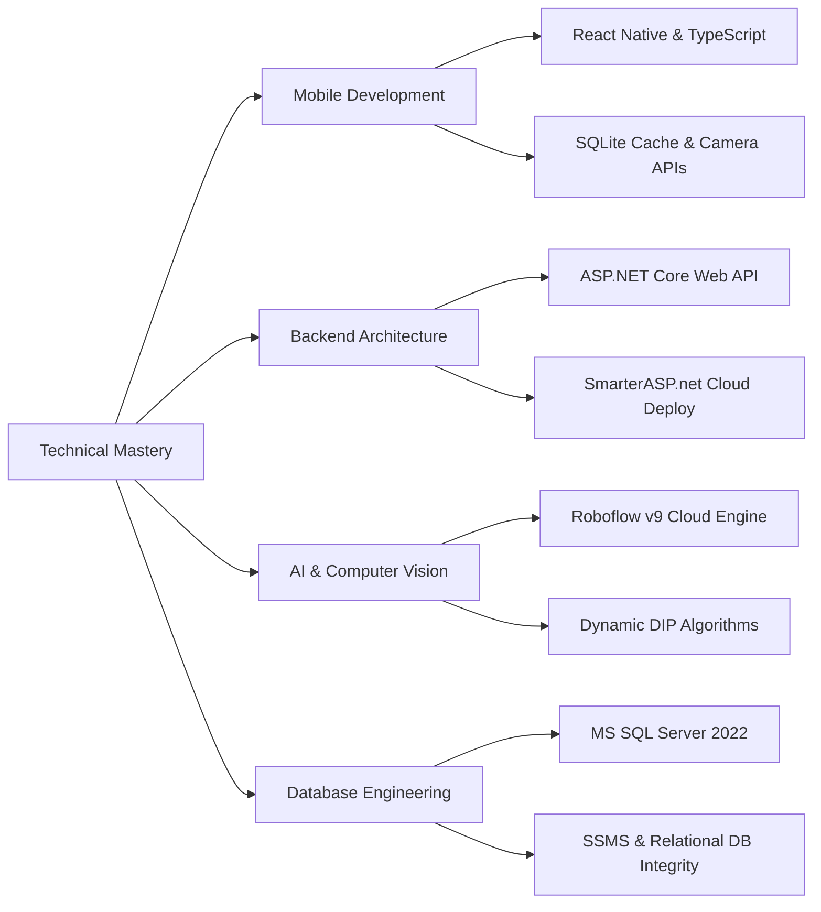
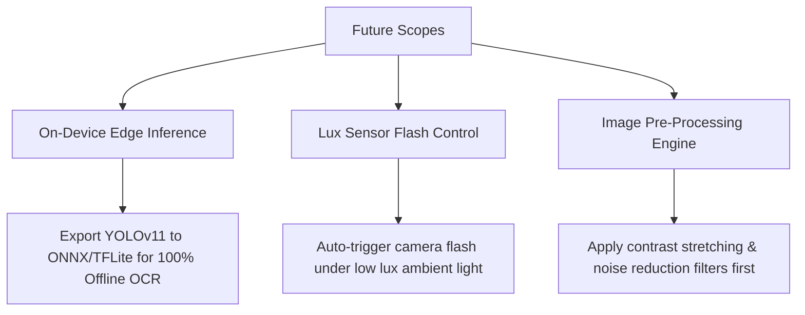

# CHAPTER 4: LESSONS LEARNED

This chapter reflects on the professional accomplishments, personal development, limitations, and future technological scopes identified during the ten-week graduation internship at **Tan Hoa Water Supply Joint Stock Company**.

---

## 4.1. Professional Accomplishments

Through active participation in the design and development of the **DocSoTH** system under the guidance of academic advisor **ThS. Trần Thanh Nhã** and the enterprise engineering department, significant technical expertise was acquired across multiple tiers:

### 4.1.1. Mobile Application Development
*   **Cross-Platform Architecture:** Gained comprehensive experience developing responsive interfaces in React Native using TypeScript, handling screen navigation transitions, local state management, and custom camera overlays.
*   **Offline Tolerance Mechanics:** Designed and implemented secure local storage caches using SQLite, managing network change listeners to automatically sync cached data once connection drops are resolved.

### 4.1.2. Enterprise Backend Engineering
*   **ASP.NET Core Integration:** Developed robust, scalable REST APIs using C# and EF Core. Implemented business logic layers to handle dynamic invoice computations (`WaterBillingService.TinhTienNuoc`), and bulk importing operations (`UploadBienDong`) to process complex CSV/Excel files.
*   **Cloud Deployment:** Managed production deployments to cloud platforms (SmarterASP.net hosting), configuring connection strings, bypass authorization tokens, and handling timeout protocols.

### 4.1.3. Computer Vision and AI Integration
*   **Cloud AI Model Training:** Leveraged transfer learning principles to customize the YOLOv11 framework via Roboflow Cloud. Acquired skills in dataset annotation, hyperparameter adjustments, and model evaluation metrics (mAP, Precision, Recall).
*   **Digital Image Processing (DIP) Filters:** Implemented dynamic python algorithms (`filter_y_cluster`, `filter_size`, and `filter_small_trailing_digits`) to isolate noise, group misaligned digits, and discard trailing red decimal digits from mechanical dials.

### 4.1.4. Database Administration
*   **Relational Integrity:** Structuring database entities (`DocSo`, `NguoiDungB`, `Lich_DocSo`, `LichSuDocSo`) within Microsoft SQL Server 2022. Mastered using SQL Server Management Studio (SSMS) to manage relationships, foreign keys, and indexes for optimized query performance.

---

## 4.2. Personal Growth and Soft Skills

Beyond technical acquisition, the internship served as a bridge between academic theories and industrial applications:

*   **Agile Project Management:** Participated in Iterative Agile workflows, executing weekly sprint cycles, presenting visual prototypes to supervisors, and prioritizing backlogs based on strict corporate deadlines.
*   **Interdepartmental Collaboration:** Worked directly with senior engineers and sales executives (such as representatives **Mr. Vo Tan Tai** and **Mr. Le Trung Thành**), learning to translate real-world business constraints (like SAWACO billing parameters and regional groundwater campaigns) into system constraints.
*   **Time Management & Stress Resilience:** Balanced simultaneous requirements across front-end rendering, API routing, and AI performance validation, adhering strictly to the institution’s milestone calendar.

---

## 4.3. Limitations and Future Scope

While the **DocSoTH** system successfully addresses the company's automated recording goals, several structural and physical limitations were identified, presenting opportunities for future system evolution.

### 4.3.1. Identified System Limitations

#### 1. Local Network Dependency for Physical Testing
During field deployments, physical mobile devices (Android/iOS) must establish connection to the FastAPI server running locally on port `8001`. Setting up matching local IP addresses (e.g. `192.168.1.94`) in the mobile settings remains a bottleneck for manual configuration by end-users.

#### 2. Cloud API Network Dependencies
Since the digital image parser queries the Roboflow Cloud API, the system depends heavily on continuous cellular connectivity. If network latency increases, or if the serverless model encounters cold starts, surveyor wait times can increase.

#### 3. Environmental Distortions
Water meters are frequently located in deep, wet, or mud-soiled wells. Extreme dial condensation, heavy mud deposits, or scratched glass displays can drop AI confidence rates, routing them to administrative manual reviews.

### 4.3.2. Future Development Scopes

#### 1. On-Device Edge Inference (YOLOv11 ONNX Integration)
*   **Objective:** Eliminate API network dependencies.
*   **Implementation:** Convert the trained YOLOv11 model weights into highly optimized **ONNX** or **TensorFlow Lite (TFLite)** formats and run them directly inside the React Native application using native neural network runners (e.g., `onnxruntime-react-native`). This achieves **100% offline edge OCR** processing with zero network latency.

#### 2. Ambient Light Auto-Flash Integration
*   **Objective:** Stabilize image capture in deep basements or low-light wells.
*   **Implementation:** Access the mobile device's physical ambient lux light sensor using React Native libraries. If lux measurements drop below a designated threshold (e.g., 20 lux), automatically activate the camera flash before capture to prevent blurry, low-confidence OCR results.

#### 3. Advanced Digital Image Pre-Processing Engine
*   **Objective:** Enhance visibility of soiled, dusty, or scratched water meters.
*   **Implementation:** Run client-side pre-processing steps using light libraries (such as OpenCV for React Native). Apply histogram equalization, contrast-limited adaptive histogram equalization (CLAHE), and bilateral filtering to reduce noise and enhance LCD segments before running YOLOv11 inference.
